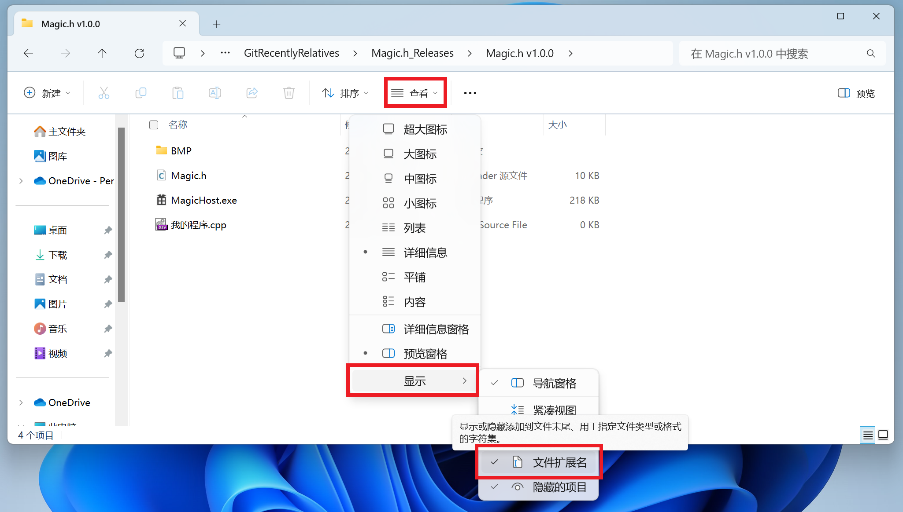

# Chapter.0 下载配置

## 1. 下载框架文件

首先，进入我们的Magic.h框架的项目页面：

- 主仓库：https://gitee.com/SirJackie/Magic.h
- 海外加速：https://github.com/SirJackie/Magic.h

在右侧“发行版/Release”处，找到最新的版本，点击蓝色字体进入下载：


点击下载Zip发行版压缩包：


下载压缩包后，请不要直接打开，咱们先进行解压：


解压后，我们获得3个项目，说明如下：


## 2. 创建第一个程序！

### 2.1. 使用Dev-C++编译器创建程序

这是最简单的方法，非常适合新手入门。

在我们刚才解压获得的文件夹下面，新建一个文本文档：


将默认的文件名 `新建 Text Document.txt` 改成 `我的程序.cpp`，然后双击，即可使用Dev-C++编译器打开：


> 遇到问题？请看如何解决：
>
> - 问题一：默认的文件名没有后缀名 `.txt`，只有 `新建 Text Document`
>
>   这种情况下，您需要打开系统的“后缀名显示”。
>
>   请在当前文件夹处，点击“查看——显示——文件扩展名”，确保是打勾的状态，即可：
>
>   
>
> - 问题二：双击 `我的程序.cpp`，没法打开Dev-C++
>
>   这种情况下，您需要选择好“默认应用程序”。
>
>   右键 `我的程序.cpp`——属性：
>
>   
>
>   点击“更改”：
>
>   
>
>   选择正确的“默认应用程序”，也就是Dev-C++：
>
>   

打开Dev-C++后，请你复制如下代码进入：

```c
#include <stdio.h>
#include "Magic.h"

int main(){
	Magic();
	
	while (true){
		for (int y = 0; y < 600; y++){
			for (int x = 0; x < 800; x++){
				MagicSetPixel(x, y, x, y, 0);
			}
		}
		
		Show();
	}
}
```

然后，点击“编译并运行”按钮：


叮当！我们的第一个图形程序就完成啦！看到能用如此少的代码实现这种效果，还是很开心的😆：


具体的代码含义，将会在下一篇文章介绍，稍等片刻😂

### 2.2. 使用Visual Studio IDE创建程序

启动Visual Studio，选择“创建新项目”：


选择“控制台程序”，下一步：


填写项目名称，并选择一个合适的项目位置（**需要记住你的项目位置，等下会用到**）：


项目创建成功：


复制如下代码进入：

```c
#include <stdio.h>
#include "Magic.h"

int main(){
	Magic();
	
	while (true){
		for (int y = 0; y < 600; y++){
			for (int x = 0; x < 800; x++){
				MagicSetPixel(x, y, x, y, 0);
			}
		}
		
		Show();
	}
}
```

会发现出现很多报错：


这是因为我们还没有引入Magic.h库文件，所以VS无法识别。

我们需要打开**刚才记住的项目位置**，将几个文件复制进去：


之后，在VS中，右键“头文件”——“添加”——“现有项”：


选择我们刚才复制进来的“Magic.h”，点击“添加”：


可以看到，所有报错消失了！现在，点击“本地Windows调试器”按钮，来编译运行程序：


叮当！我们的第一个图形程序就完成啦！看到能用如此少的代码实现这种效果，还是很开心的😆：


具体的代码含义，将会在下一篇文章介绍，稍等片刻😂

## 3. 尖括号？双引号？


## 4. 更多精彩的示例程序！

咱们回到刚才的项目首页，点击“Demos”文件夹：


就可以找到十几个好玩的示例程序：


我们试着打开一个（以 `Demo_Trampoline_v1.cpp` 为例），鼠标拖动，全部选择，右键复制：


粘贴进入我们的VS/Dev-C++ IDE：


> **警告：VS粘贴后，第一行会出现莫名报错。**
>
> **解决方法：手动删除第一行，重新用键盘敲一遍，即可解决😂**
>
> 重新手敲后，恢复正常：
>
> 

**注意：可以将上方编译模式改为“Release x64”，可以显著提高帧率！（30FPS => 60FPS，最高支持165FPS）**


接着，点击按钮，来编译并运行程序：


可以看到，一个蹦床游戏Demo被成功编译：


GIF动图不能体现它的全部实力和流畅度😄不妨尝试自己编译一下，感受这个框架的丝滑！

以上就是Magic.h框架的基本配置教程。下一章，我们将开始图形编程的魔法之旅，敬请期待！

