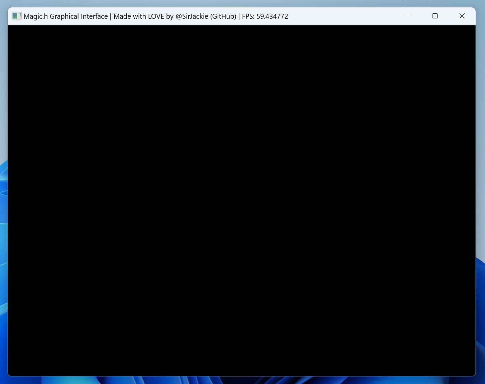

# Chapter.1 快速开始

这是一个平平无奇的C语言“Hello World”代码：

```c
#include <stdio.h>

int main(){
	printf("Hello World!");
}
```

只需要**增加一行代码**，就可以**创建窗口**，进入**可视化编程**的世界！

```c
#include <stdio.h>
#include "Magic.h"  // 引入Magic图形库

int main(){
	printf("Hello World!");
	
	Magic();  // 创建窗口
}
```

Magic！魔法生效，窗口成功出现：


但由于我们还**没有正确初始化**，所以上面的窗口，正在循环播放“正加载”的方块动画。

想要正确初始化，我们需要创建一个“**游戏循环**”（Game Loop），以每秒60FPS的速度展示画面（Show）。对于游戏循环，推荐用一个**While死循环**来实现：

> 注：不用担心While死循环太快，导致帧率超过60FPS。
>
> 因为Magic.h图形框架做了锁帧处理，超过60FPS的帧率会被强制锁在60FPS，以确保不同性能的设备，动画速度相同，并能够避免初学者接触 `deltaTime` 概念的麻烦。

```c
#include <stdio.h>
#include "Magic.h"

int main(){
	Magic();
	
	while (true) {
		Show();  // 以每秒60FPS的速度展示画面（Show）
	}
}
```

现在，我们实现了正确的初始化，成功创建出了“游戏循环”：



可以看到，窗口是全黑的，因为我们还没有画任何东西。

下一章我们将介绍：如何绘制图形；敬请期待！

