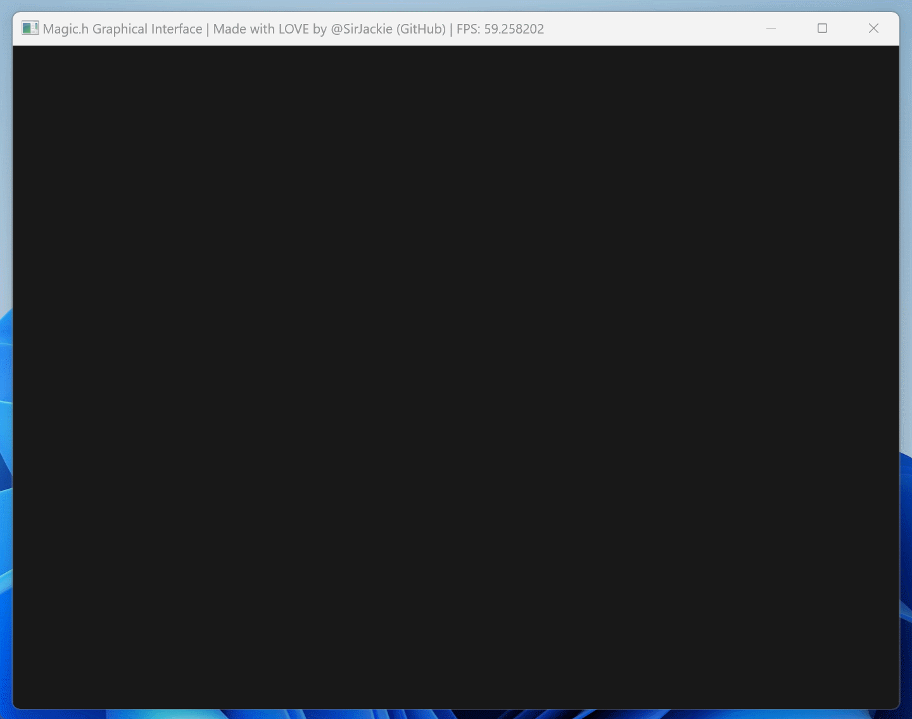

# Chapter.2 绘制像素

书接上回，我们创建了一个游戏循环，但没有绘制任何东西：

```c
#include <stdio.h>
#include "Magic.h"

int main(){
	Magic();
	
	while (true) {
		Show();
	}
}
```

现在，让我们一起来**绘制第一个的图形**——像素：

```c
#include <stdio.h>
#include "Magic.h"

int main(){
	Magic();
	
	while (true) {
		MagicSetPixel(100, 50, 255, 255, 255);  // 绘制一个白色像素
		
		Show();
	}
}
```

像素的一小步，魔法的一大步😂：


绘制像素的代码，需要传入这5个值：

```
MagicSetPixel(x, y, r, g, b);
```

- x：横坐标位置，上文是100
- y：纵座标位置，上文是50
- r：红色分量
- g：绿色分量
- b：蓝色分量

> 注：Magic库为您提供了安全保护，如果X Y坐标值超出屏幕范围，会被忽略，而不会像其他框架产生报错和崩溃，所以请您放心！

红色、绿色、蓝色分量的**范围都是从0到255**，数字越大，这种颜色亮度越强。

通过改变红色、绿色、蓝色分量的大小，就能**合成出任何颜色**：


> ```
> Image Source: 
> By Immanuelle - Own work, CC BY-SA 4.0, https://commons.wikimedia.org/w/index.php?curid=132469198
> ```

以下是一些常见的颜色：

- 黑色：0 0 0
- 白色：255 255 255
- 红色：255 0 0
- 绿色：0 255 0
- 蓝色：0 0 255
- 黄色：255 255 0
- 天蓝色：0 255 255
- 粉色：255 0 255
- 水蓝色：0 255 213
- 海蓝色：0 144 255

我们试着把这些颜色绘制出来，看看效果：

```c
#include <stdio.h>
#include "Magic.h"

int main(){
	Magic();
	
	while (true) {
		MagicSetPixel(100, 50, 255, 255, 255);  // 白色
		MagicSetPixel(102, 50, 255, 0, 0);      // 红色
		MagicSetPixel(104, 50, 0, 255, 0);      // 绿色
		MagicSetPixel(100, 52, 0, 0, 255);      // 蓝色
		MagicSetPixel(102, 52, 255, 255, 0);    // 黄色
		MagicSetPixel(104, 52, 0, 255, 255);    // 天蓝色
		MagicSetPixel(100, 54, 255, 0, 255);    // 粉色
		MagicSetPixel(102, 54, 0, 255, 213);    // 水蓝色
		MagicSetPixel(104, 54, 0, 144, 255);    // 海蓝色
		
		Show();
	}
}
```

效果如下，还是非常有意思的：


但现在又一个问题：像素太小，看不清怎么办？

答案：我们可以使用For循环，大批量的绘制像素，就能更好看见了！

例如：

```c
#include <stdio.h>
#include "Magic.h"

int main(){
	Magic();
	
	while (true) {
		for (int i = 100; i < 200; i++){
			MagicSetPixel(i, 50, 255, 255, 255);
		}
		
		Show();
	}
}
```

运行程序，我们发现，一条直线被绘制了出来：


这是因为，`MagicSetPixel()` 的横座标，随着 `i` 的增加不断增加，所以“**点动成线**”！

既然能够“点动成线”，我们就可以进一步，实现“**线动成面**”：

```c
#include <stdio.h>
#include "Magic.h"

int main(){
	Magic();
	
	while (true) {
		for (int y = 100; y < 200; y++){
			for (int x = 100; x < 200; x++){
				MagicSetPixel(x, y, 255, 255, 255);
			}
		}
		
		Show();
	}
}
```

恭喜！我们成功绘制出了一个正方形：


每次都写For循环未免太累，别担心，Magic库为你准备好了函数：

```
void Fill(int x0, int y0, int x1, int y1, char r, char g, char b)；
```

只需要指定两个点：(x0, y0) ，(x1, y1)，以及颜色：(r, g, b)，就能用颜色填充指定区域。

例如：

```c
#include <stdio.h>
#include "Magic.h"

int main(){
	Magic();
	
	while (true) {
		Fill(100, 100, 200, 200, 255, 255, 255);
		
		Show();
	}
}
```

我们同样绘制出了一个正方形：


如果你希望用某种颜色填满整个屏幕（清屏），一种方法是：

```c
Fill(0, 0, 800, 600, 255, 255, 255);
```

> 注：Magic库生成的窗口，长宽像素恒为800 x 600，如果屏幕太大，会自动拉伸到合适尺寸，请不用担心。

而更快的方法，是使用我们提供的Clean函数：

```c
Clean(255, 255, 255);
```

例如：

```c
#include <stdio.h>
#include "Magic.h"

int main(){
	Magic();
	
	while (true) {
		Clean(255, 255, 255);
		
		Show();
	}
}
```

我们可以看到，屏幕被填充为白色：


最后，我们一起来实现一个颜色渐变的动画😆，大概思路：

- 电影/动画，都是由很多静态的图片，快速播放形成的。
- 每张图像，叫做“**帧**”（Frame）。而更新的速度，叫做“**帧每秒**”（Frame Per Seconds，简称FPS）。例如：电影采用24FPS居多，而游戏动画采用60FPS居多。
- 游戏循环（Game Loop），也就是我们的While死循环，就是用来不断生成新的帧，并展示（Show）出来的工具。
- 我们调用 `MagicSetPixel()` 改变的像素，都被保存在“**帧缓冲/画面缓冲**”（Frame Buffer）中，并不会立刻被显示。
- 只有在每当 `Show()` 函数被执行，帧缓冲中的内容，才会被推送（Push）到屏幕上，显示出来。
- **我们只要每次改变一点点颜色，然后不断调用 `Show()` 函数，推送新的画面，就能实现动画**！

具体代码：

```c
#include <stdio.h>
#include "Magic.h"

int main(){
	Magic();
	
	int color = 0;
	
	while (true) {
		Clean(color, color, color);
		color = color + 1;
		
		if (color >= 255){
			color = 0;
		}
		
		Show();
	}
}
```

恭喜！我们作出了我们自己的第一个动画！



