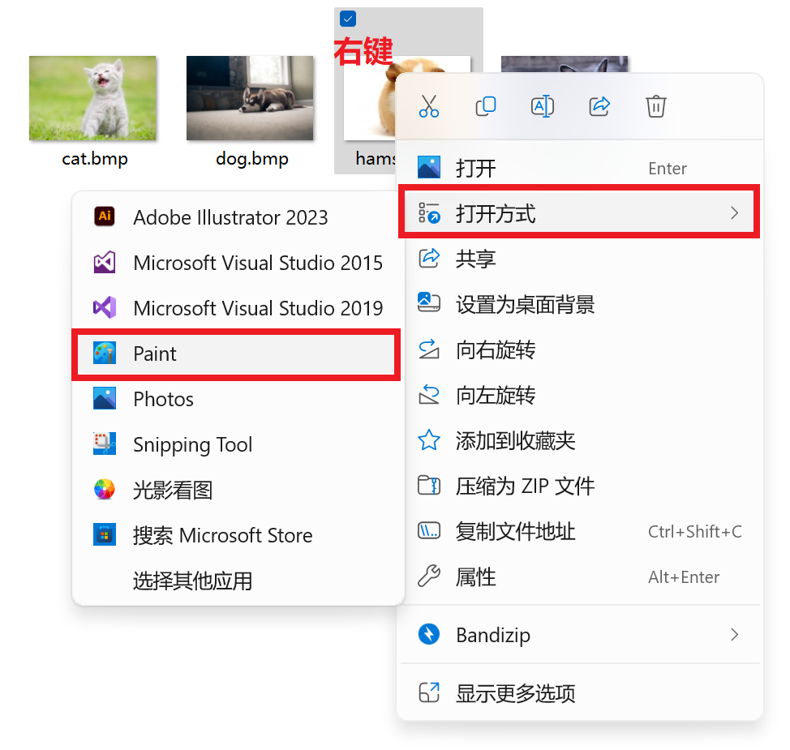
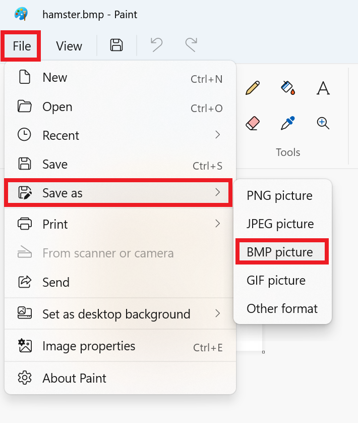
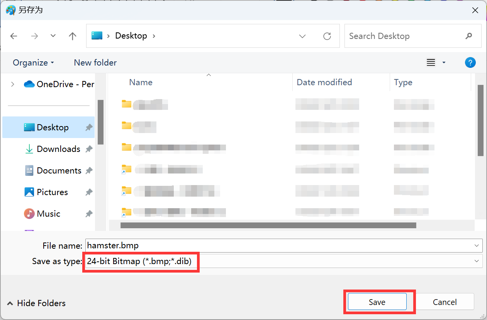
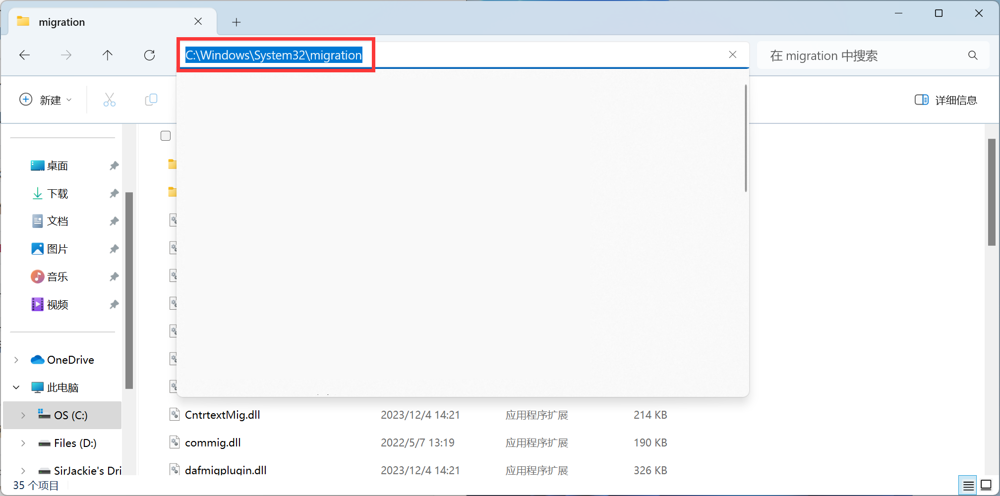
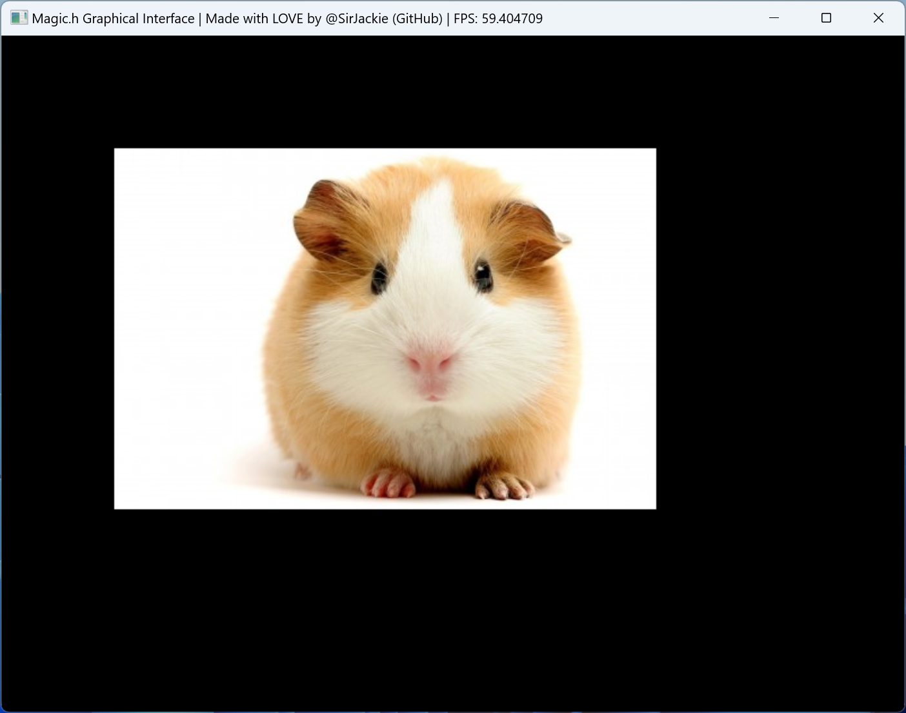
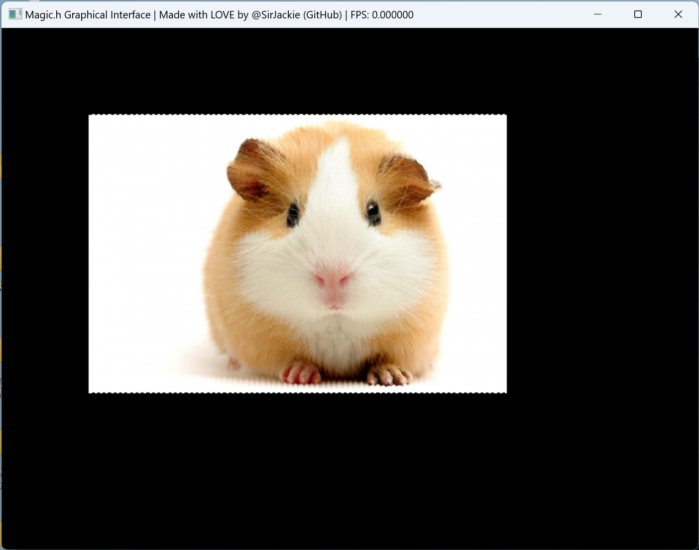

# Chapter.3 绘制图片

Magic框架支持绘制图片，并且**仅支持BMP格式**的图片。

当你有其他格式的图片时，请使用“画图”软件打开，并另存为BMP图片，即可**转换**：







Magic库为您准备了一些预设图片，放置在BMP文件夹中，可以用来做测试：


-----

首先，我们创建一个图片变量：

```c
Picture picture;
```

**Magic提供了图片类型 `Picture`**，`Picture` 类型和 `int` `float` `char` 类型一样，都是一种类型，`Picture` 类型可以存储一张图片。

上面的代码，是创建了一个名字叫做 `picture` 的变量，类型是图片类型 `Picture`（注意大小写，大P是类型名字，小p是变量名字）。

-----

光创建还不够，现在这个变量是空的。

想要加载图片进来，可以**调用变量的“成员函数”**。

简单来说，就是 `picture` 的变量是一个高级的自定义变量，所以，它能够拥有一些自己独立的函数，用 `picture.XXX()` 的格式，来进行调用。

下面是一个加载图片的代码例子：

```c
picture.Load(".\\BMP\\hamster.bmp");
```

代码调用了 `picture.Load()` 成员函数，来加载一个图片。

注意：调用 `picture.Load()` 图片加载函数时，需要传入一个字符串，代表“你想要加载哪一张图片”。字符串的内容，就是图片的路径。

Windows下，路径中，用反斜杠 `\` 来隔开文件夹：



例如上面的路径：

```
C:\Windows\System32\migration
```

**但是，C语言字符串中，不允许直接输入反斜杠，每个反斜杠，一定要替换成双反斜杠**：

```c
"C:\\Windows\\System32\\migration"
```

所以，以下就是一个合法的图片路径案例：

```c
"C:\\Downloads\\Magic.h\\BMP\\hamster.bmp"
```

但是，这种**绝对路径太死板**，文件夹整个移动一下，路径就改变了，导致程序失败。

为了解决这个问题，我们使用相对路径：

```c
".\\BMP\\hamster.bmp"
```

**英文句号 `.` 的意思，是“从当前目录下开始算起”。**

所以，上面的路径，就表示“这个目录里面的BMP文件夹，里面的hamster.bmp这张图片”。

-----

在经过上文的知识铺垫后，我们可以动手编写一段代码，加载并绘制图片啦😆！

**如下是一段绘制图片的程序**：

使用了 `picture.Draw(100, 100)` 把图片绘制到举例窗口左上角 (100, 100) 像素的位置。

```c
#include <stdio.h>
#include "Magic.h"

int main(){
	Magic();
	
	Picture picture;
	picture.Load(".\\BMP\\hamster.bmp");
	
	while (true) {
		picture.Draw(100, 100);
		
		Show();
	}
}
```

程序运行后，成功绘制了一张图片！



-----

使用 `picture.Draw(100, 100)`，虽然很方便，但缺乏对具体细节的控制。

我们可以使用 `picture.GetR/G/B()` 函数，获得图片每一个像素的RGB颜色值，再搭配 `MagicSetPixel()` 来绘制到屏幕上，实现更为精细的图片绘制：

> 注：可以使用 `picture.width` 和 `picture.height` 来获得图片的宽度和高度

```c
#include <stdio.h>
#include "Magic.h"

int main(){
	Magic();
	
	Picture picture;
	picture.Load(".\\BMP\\hamster.bmp");
	
	while (true) {
		for (int y = 0; y < picture.height; y++){
			for (int x = 0; x < picture.width; x++){
				MagicSetPixel(
					x + 100, y + 100,
					picture.GetR(x, y),
					picture.GetG(x, y),
					picture.GetB(x, y)
				);
			}
		}
		
		Show();
	}
}
```

这段代码，同样实现了完全相同的效果：


-----

你会问：说好的精细控制呢？

别急，马上就来😂：

既然我们能够控制每一个像素的绘制，我们就可以让每个像素的Y座标，偏离sin(x)这么长一段举例，从而实现正弦波浪效果：

```c
#include <stdio.h>
#include <math.h>
#include "Magic.h"

int main(){
	Magic();
	
	Picture picture;
	picture.Load(".\\BMP\\hamster.bmp");
	
	while (true) {
		for (int y = 0; y < picture.height; y++){
			for (int x = 0; x < picture.width; x++){
				MagicSetPixel(
					x + 100, y + 100 + sin(x),
					picture.GetR(x, y),
					picture.GetG(x, y),
					picture.GetB(x, y)
				);
			}
		}
		
		Show();
	}
}
```

效果如下：



我们发现，这个波浪太小了！

最后一步，我们通过**调整sin函数的振幅、相位和周期**，来实现**更大更好看的波浪动画效果**：

```c
#include <stdio.h>
#include <math.h>
#include "Magic.h"

int main(){
	Magic();
	
	Picture picture;
	picture.Load(".\\BMP\\hamster.bmp");
	
	float delta = 0.0f;
	
	while (true) {
		Clean(0, 0, 0);
		
		for (int y = 0; y < picture.height; y++){
			for (int x = 0; x < picture.width; x++){
				MagicSetPixel(
					x + 100, y + 100 + sin((float)x / 20.0f + delta) * 10,
					picture.GetR(x, y),
					picture.GetG(x, y),
					picture.GetB(x, y)
				);
			}
		}
		
		Show();
		
		delta += 0.1f;
	}
}
```

效果真不错！咱们一路走过来，能实现这么酷的效果！给屏幕前的你点个赞😆


