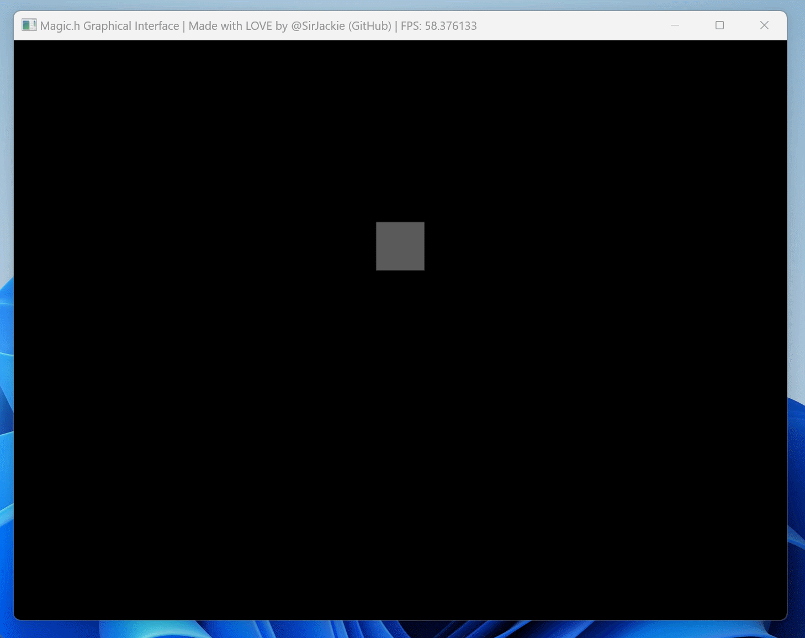
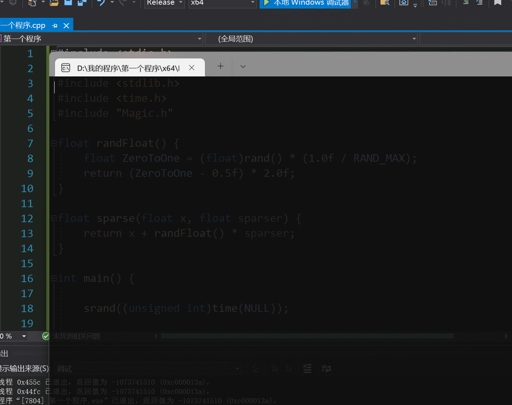

# Magic.h

## 项目介绍

简洁优雅的图形学编程框架，**一行代码即可创建窗口**！

```c
#include "Magic.h"

int main(){
	Magic();
}
```

运行效果：



## 更多 Demo 效果展示




## 现在开始！

我们准备了完善的入门教程，帮助你快速上手，迈入图形学编程的魔法大门：

### 新手教程

- [Chapter.0 下载配置](./Documentation/GetStarted/C00Setup.md)
- [Chapter.1 快速开始](./Documentation/GetStarted/C01Intro.md)
- [Chapter.2 绘制像素](./Documentation/GetStarted/C02Pixels.md)
- [Chapter.3 绘制图片](./Documentation/GetStarted/C03Picture.md)

### API 接口文档

- [API 接口文档](./Documentation/APIs/APIs.md)

